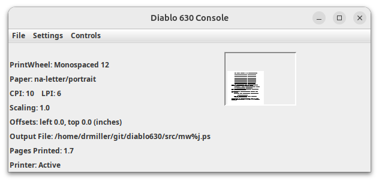

# Virtual Diablo 630 Printer

The program accepts Diable 630 (Juki 6100) input and produces PostScript
files. By default provides a GUI to allow basic printer control.
Printing is job oriented, sending a 0FFH character to the printer
indicates the end of a job (and the beginnign of a new one). This is the
same character used by CP/NET and MP/M (and ENDLIST.COM) to end a print
job (and release the printer).

The plain version "Diablo630,jar" will accept printer output on stdin.
You can type output into the progrm, or redirect from a file that contains
Diablo 630 compatible characters and ESC sequences.

ESC command compatibility is [listed here](COMPAT.md).
